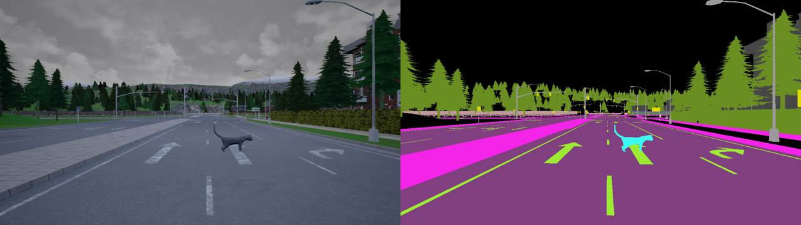
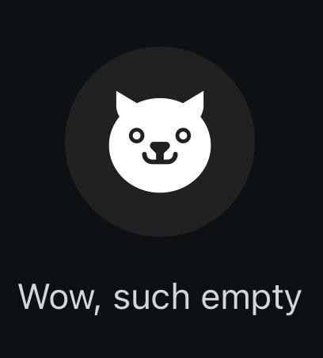

# Machine Learning for Computer Vision Assignment
University of Bologna, A.Y. 2024–2025.

---

## Introduction
Over the last few years, a large portion of the semantic segmentation literature has been focusing on improving the segmentation performance on urban-scene images. However, traditional semantic segmentation methods cannot identify *unexpected objects* (i.e. object not included in the pre-defined classes seen during training), as they predict all pixels as belonging to one of those pre-defined classes. Addressing such an issue is crucial, especially for safety-critical applications such as autonomous driving: wrongly predicting a cat (i.e. an unexpected object) on the road as the road itself does not stop the autonomous vehicle, which may lead to roadkill. In this safety-critical scenario, the cat should be detected as an unexpected object; this information should then prompt the autonomous vehicle to handle the object differently (e.g. decide whether to stop the car or circumvent the cat).

This task, which I will call ***semantic segmentation of unexpected objects on roads***, is more generally referred to in the literature as *open-set semantic segmentation*, *open-world semantic segmentation*, or *anomaly segmentation*, each with slightly different nuances of meaning depending on the paper (it would not be true deep learning otherwise).

## Dataset
The dataset you are going to work with is called StreetHazards [[1](https://arxiv.org/abs/1911.11132)]. It was created with the [CARLA](https://carla.org/) simulation environment in combination with Unreal Engine in order to realistically insert anomalous objects into synthetic urban scenes. The dataset contains 5125 training `(image, segmentation_map)` pairs, 1031 validation pairs, and 1500 test pairs. The training and validation sets feature 12 classes: `building`, `fence`, `other`, `pedestrian`, `pole`, `road line`, `road`, `sidewalk`, `vegetation`, `car`, `wall`, and `traffic sign`. The 13th class is the `anomaly` class, which appears in the test set only.

* [Training and validation sets download link](https://people.eecs.berkeley.edu/~hendrycks/streethazards_train.tar)
* [Test set download link](https://people.eecs.berkeley.edu/~hendrycks/streethazards_test.tar)

Here is an example of a test pair, where a single anomalous object appears (a cat):

  

Segmentation maps like the one above can be produced with [this script](utils/visualize.py).

## Goal
Your goal is to implement a model that is able to predict segmentation maps of input images, including masks of both known classes and the `anomaly` class. Test set `(image, semgmentation_map)` pairs (and, hence, the `anomaly` class) should remain **unseen** during training and only be used at test time.

## Rules
In order to achieve the aforementioned goal, you are allowed to use **any** method of your choice, either existing (see § [References](#references)), re-adapted, or even invented by yourself. From an implementation standpoint, you can:
* Use off-the-shelf pre-implemented PyTorch models.
* Use pre-trained weights.
* Use portions of existing code found in public repositories. If so, cite the source you took the code from.
* Use any existing library for computing metrics, displaying results or providing any other functionality you need.

Teams are not allowed: the assignment must be done **individually**.

## Submission

### What to submit
You must submit the following files:
* A notebook called `main.ipynb`. You can either put all the code into the notebook or separate it into python scripts referenced by the notebook and use the notebook only for visualization purposes and textual explanations. The notebook must be runnable: disable the training (if you leave the training code inside the notebook) and load the model(s) weights to run inference. The first cell of the notebook must contain your student ID, full name, and institutional email.
* The weights of your model(s) saved as `.pt` file(s).
* A `README.md` describing your project structure and providing instructions on how to run it: specifically, tell me if I should run it locally or on Colab, Kaggle, etc.
* If the notebook runs locally, a `requirements.txt` containing the packages I need to install to run it.
* Any other file needed to run the notebook.

### How to submit
You must submit your files through the dedicated [assignment submission form](https://virtuale.unibo.it/mod/assign/view.php?id=1821159) in the course page on Virtuale. You can submit at most 20 files with maximum size 20 MB each (both limits imposed by Virtuale itself). In case some of your files exceed 20 MB (e.g. the model weights), upload them on your institutional OneDrive and add a public link to them in your `README.md`.

### When to submit
Make sure to submit the assignment **before** you write to prof. Salti to schedule the oral exam. Put me in cc when you do so, so that I will see when your exam gets scheduled and I can make sure your assignment has been graded by the time you attend the exam. The assignment can only be submitted once per academic year.

## Evaluation
My evaluation of your work will be based on:
1. **Qualitative results**, i.e. segmentation maps predicted by your model when given as input unseen images containing anomalous objects.
2. **Quantitative results** (a.k.a. metrics), which, following the terminology of [[2](https://arxiv.org/abs/2108.04562)], you can divide into two subtasks:
    * *Closed-set semantic segmentation*, i.e. semantic segmentation of non-anomalous objects, for which you shpuld use standard mIoU
    * *Anomaly segmentation*, i.e. detecting unexpected object at the pixel level, for which metrics you should use AUPR (a.k.a. AP).

    These metrics should guide you in the design and tuning of your model. Look into papers showing experiments on StreetHazards (e.g. [[1](https://arxiv.org/abs/1911.11132), [2](https://arxiv.org/abs/2108.04562), [4](https://arxiv.org/abs/2211.14512)]) to know the range of values you should strive for.
3. **Experimental procedure**. Do not just show me the results of your final model; instead, perform ablation studies that (empirically) prove how your choices positively affect the model performance. Any result you show must be critically discussed and/or interpreted and have an actual impact on your investigation.
4. **Clarity of exposition and code readability**. `main.ipynb` must be a combination of textual and code cells whose content is intertwined: do not write text cells referencing code that I cannot see anywhere (not even in external scripts) nor write non-trivial code cells with no textual explanation preceding them. External scripts, if present, should be well-structured (classes, functions, etc.), well-written (mnemonic variable names, no random commented lines, etc.) and well-documented. Plots and tables are always welcomed.

Keep in mind that this is **not** a challenge: you will **not** be ranked based on the segmentation and detection scores you achieve. Therefore, points 3 and 4 will be as impactful on the final grade as points 1 and 2.

You will receive a score from 0 to 10, that will be summed to your oral exam score yielding a total of ≤ 32 (= 30 + laude) points. The assignment grade will be displayed on Virtuale before you attend the oral exam.

## References
What follows is a (non-exhaustive) list of papers you might want to take a look at:

[[1](https://arxiv.org/abs/1911.11132)] Hendrycks et al. "Scaling Out-of-Distribution Detection for Real-World Settings". ICML 2022.\
[[2](https://arxiv.org/abs/2108.04562)] Cen et al. "Deep Metric Learning for Open World Semantic Segmentation". ICCV 2021.\
[[3](https://arxiv.org/abs/2107.11264)] Jung et al. "Standardized Max Logits: A Simple yet Effective Approach for Identifying Unexpected Road Obstacles in Urban-Scene Segmentation". ICCV 2021.\
[[4](https://arxiv.org/abs/2211.14512)] Liu et al. "Residual Pattern Learning for Pixel-wise Out-of-Distribution Detection in Semantic Segmentation". ICCV 2023.\
[[5](https://arxiv.org/abs/2403.07532)] Sodano et al. "Open-World Semantic Segmentation Including Class Similarity". CVPR 2024.

## FAQ
This section will be dynamically updated in the following weeks/months as I receive questions about the assignment.

  

